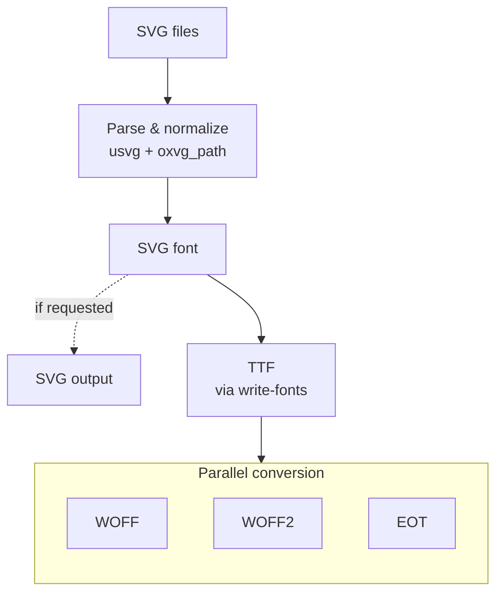

  

# Webfont Generator

`@atlowchemi/webfont-generator` is a native Rust NAPI addon that generates webfonts (SVG, TTF, EOT, WOFF, WOFF2) from SVG icon files. It is the engine that powers `vite-svg-2-webfont`.

## Why a new engine

The original [`@vusion/webfonts-generator`](https://github.com/vusion/webfonts-generator) by the Vusion team has not been updated in a long while. Its JavaScript pipeline depends on several separate packages, and has not received updates in years. `@atlowchemi/webfont-generator` is a ground-up rewrite in Rust that preserves the upstream API surface while delivering better performance and long-term maintainability.

::: tip Attribution
The API design and Handlebars template system are deeply based on `@vusion/webfonts-generator`. Credit to the team for the original architecture.
:::

## Architecture

The generation pipeline works as follows:

1. **SVG loading** -- Read and validate source SVG files in parallel
2. **SVG font assembly** -- Parse glyph paths with `usvg` and `oxvg_path`, normalize metrics, and build an SVG font document
3. **TTF conversion** -- Convert the SVG font to TrueType using [`write-fonts`](https://github.com/googlefonts/fontations)
4. **Parallel format conversion** -- From the TTF binary, produce WOFF, WOFF2, and EOT in parallel
5. **Template rendering** -- Render CSS and HTML preview files via Handlebars templates

## Performance

The native Rust pipeline scales better than the original JavaScript implementation as glyph count grows. Parallel font format conversion and zero-copy path normalization reduce wall-clock time significantly for large icon sets.

## Compatibility

The API is largely compatible with upstream `@vusion/webfonts-generator`, with a few documented differences:

- The `cssContext`, and `htmlContext` callbacks signature is simplified -- it receives a context object and returns the mutated object, rather than accepting a second argument
- Font binaries differ at the byte level (different TTF compiler, different path normalization) but are valid and render identically
- `normalize` defaults to `true` (upstream defaults to `false`)
- `ligature` support is built-in (defaults to `true`)

::: warning
If you are migrating from `@vusion/webfonts-generator`, review the [Node.js usage](./node) page for the full options reference.
:::

## Available as

| Distribution | Package                                                                                        | Install                                          |
| ------------ | ---------------------------------------------------------------------------------------------- | ------------------------------------------------ |
| npm          | [`@atlowchemi/webfont-generator`](https://www.npmjs.com/package/@atlowchemi/webfont-generator) | `npm install @atlowchemi/webfont-generator`      |
| crates.io    | [`webfont-generator`](https://crates.io/crates/webfont-generator)                              | `cargo add webfont-generator`                    |
| CLI          | [`webfont-generator`](https://crates.io/crates/webfont-generator)                              | `cargo install webfont-generator --features cli` |

## Links

- [npm package](https://www.npmjs.com/package/@atlowchemi/webfont-generator)
- [crates.io](https://crates.io/crates/webfont-generator)
- [docs.rs](https://docs.rs/webfont-generator)
- [GitHub repository](https://github.com/atlowChemi/vite-svg-2-webfont)

## Next steps

- [Node.js usage](./node) -- npm package API reference
- [Rust usage](./rust) -- crate API reference
- [CLI usage](./cli) -- command-line interface
- [Changelog](./changelog) -- release history
