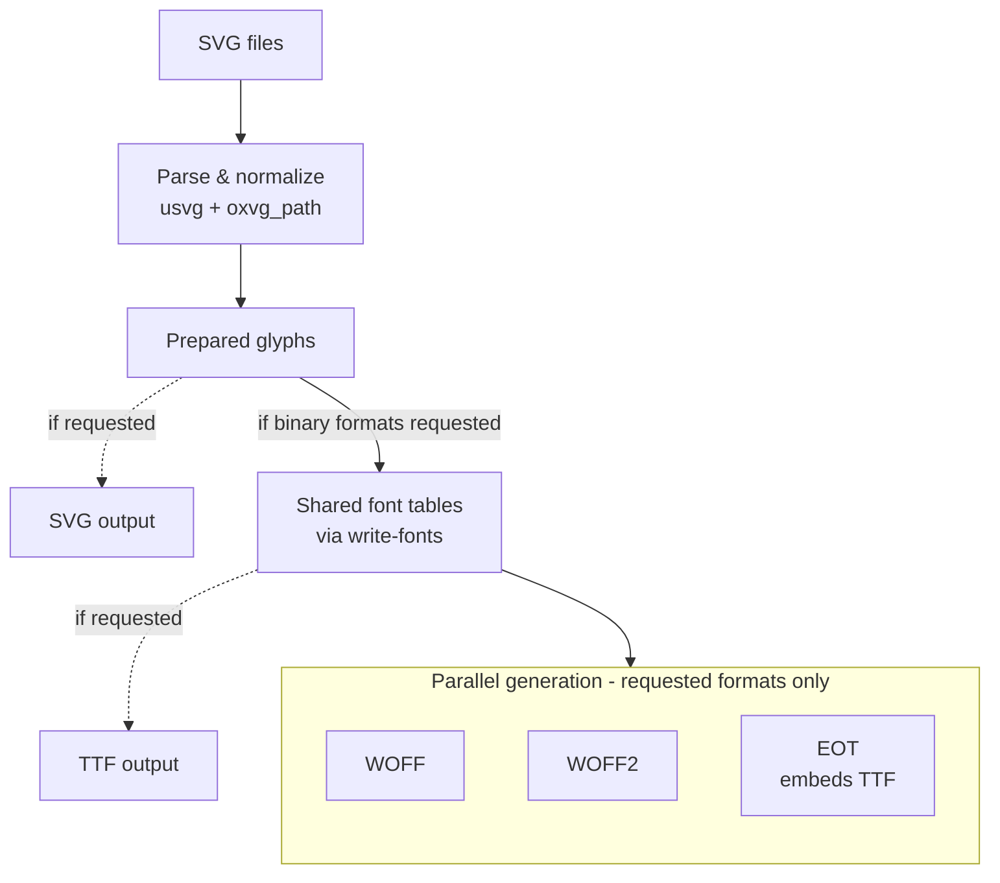
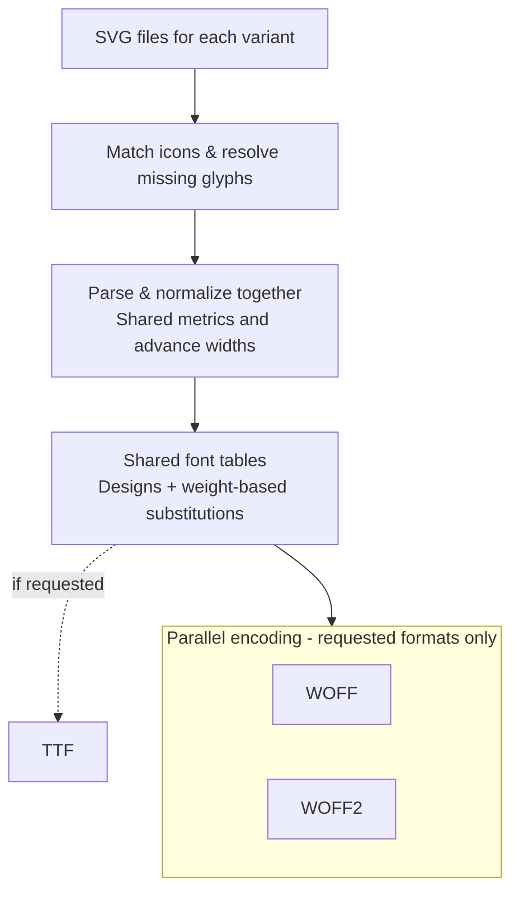

  

# Webfont Generator

`@atlowchemi/webfont-generator` is a native Rust NAPI addon that generates webfonts (SVG, TTF, EOT, WOFF, WOFF2) from SVG icon files. It is the engine that powers `vite-svg-2-webfont`.

## Why a new engine

The JavaScript lineage started with [`webfonts-generator`](https://github.com/sunflowerdeath/webfonts-generator) by sunflowerdeath, which the Vusion team forked as [`@vusion/webfonts-generator`](https://github.com/vusion/webfonts-generator). Neither project has received updates in years, and both rely on a JavaScript pipeline spanning several separate packages. `@atlowchemi/webfont-generator` is a ground-up rewrite in Rust that keeps the familiar API while delivering better performance and long-term maintainability.

Owning the full pipeline made a new parallel architecture possible. The engine parses and normalizes glyphs once, then shares their prepared geometry between SVG output and binary font compilation. SVG serialization and font-table compilation can run in parallel, followed by parallel WOFF, WOFF2, and EOT generation. WOFF and WOFF2 consume the compiled tables directly, avoiding an intermediate TTF serialization and reparse. Together with parallel glyph processing, this reduces repeated work and makes better use of multiple CPU cores.

The result: **over 6× faster on average** than `@vusion/webfonts-generator` in our 100-, 300-, and 600-glyph, all-format benchmarks on an Apple M4 Max, both with the default settings and with optional SVG path optimization enabled. See [Performance](#performance) for the timings.

::: tip Attribution
The API design and Handlebars template system build on sunflowerdeath's original `webfonts-generator` and the Vusion team's `@vusion/webfonts-generator` fork. Credit to sunflowerdeath, the Vusion team, and the contributors to both projects for that foundation.
:::

## Architecture

### Single-face fonts

For a single-face font, the generation pipeline works as follows:

1. **SVG loading** -- Read and validate source SVG files in parallel
2. **Glyph preparation** -- Parse glyph paths with `usvg`, process geometry with `oxvg_path`, and normalize metrics into a shared prepared glyph set
3. **Parallel SVG and table assembly** -- Serialize the SVG font if requested, and compile prepared geometry into shared TrueType/OpenType tables using [`write-fonts`](https://github.com/googlefonts/fontations) when binary formats are needed
4. **Requested binary outputs** -- Assemble TTF if requested; generate WOFF, WOFF2, and EOT in parallel from the shared tables. EOT embeds a lazily assembled TTF binary, while WOFF and WOFF2 use the tables directly
5. **Template rendering** -- Render CSS and HTML previews via Handlebars when writing those files or calling the result's rendering methods

```mermaid
flowchart TD
    A[SVG files] --> B[Parse &amp; normalize<br/>usvg + oxvg_path]
    B --> C[Prepared glyphs]
    C -.->|if requested| D[SVG output]
    C -->|if binary formats requested| E[Shared font tables<br/>via write-fonts]
    E -.->|if requested| T[TTF output]
    E --> P
    subgraph P[Parallel generation - requested formats only]
        direction TD
        F[WOFF]
        G[WOFF2]
        H[EOT<br/>embeds TTF]
    end
```

### Multi-variant fonts

For a family such as light, regular, and bold, the engine combines the designs into **one font file per requested format**:

1. **Family assembly** -- Load each variant's SVGs, match icons by name, assign shared codepoints, and apply the missing-glyph policy.
2. **Shared glyph preparation** -- Parse the designs and normalize them using family-wide metrics and shared advance widths, keeping icons aligned when switching variants.
3. **Variant compilation** -- Compile all designs into shared font tables with weight-axis metadata and glyph-substitution rules. Selecting a weight chooses one of the supplied designs rather than interpolating between outlines.
4. **Output and templates** -- Assemble TTF if requested, encode requested WOFF and WOFF2 outputs in parallel, and render CSS/HTML with variant metadata and modifier classes.

```mermaid
flowchart TD
    A[SVG files for each variant] --> B[Match icons &amp; resolve missing glyphs]
    B --> C[Parse &amp; normalize together<br/>Shared metrics and advance widths]
    C --> D[Shared font tables<br/>Designs + weight-based substitutions]
    D -.->|if requested| E[TTF]
    D --> P
    subgraph P[Parallel encoding - requested formats only]
        F[WOFF]
        G[WOFF2]
    end
```

This path supports TTF, WOFF, and WOFF2; SVG/EOT output is available only for single-face fonts. Multi-variant families also support incremental regeneration, reusing cached geometry for unchanged designs. See [multi-variant fonts](./node#multi-variant-fonts) for usage.

## Performance

The legacy `@vusion/webfonts-generator` engine does not support SVG path optimization. The Rust engine adds it through [`optimizeOutput`](./node#optimizeoutput) and is still faster with optimization enabled. The tables show the Rust engine with path optimization disabled and enabled side by side.

### All formats

Generating SVG, TTF, EOT, WOFF, and WOFF2:

| Glyphs | `@vusion/webfonts-generator` | Rust engine                                       | Rust engine (Optimized SVG) |
| ------ | ---------------------------- | ------------------------------------------------- | --------------------------- |
| 100    | 65.6 ms                      | <strong class="benchmark-winner">11.8 ms</strong> | 12.0 ms                     |
| 300    | 256.1 ms                     | <strong class="benchmark-winner">39.0 ms</strong> | 41.9 ms                     |
| 600    | 523.3 ms                     | <strong class="benchmark-winner">72.9 ms</strong> | 79.2 ms                     |

### Modern web formats

If you only need web delivery formats, the same comparison with **WOFF2 only** or **WOFF + WOFF2** gives:

| Formats      | Glyphs | `@vusion/webfonts-generator` | Rust engine                                       | Rust engine (Optimized SVG) |
| ------------ | ------ | ---------------------------- | ------------------------------------------------- | --------------------------- |
| WOFF2        | 100    | 64.0 ms                      | <strong class="benchmark-winner">11.6 ms</strong> | 12.6 ms                     |
| WOFF2        | 300    | 254.6 ms                     | <strong class="benchmark-winner">39.1 ms</strong> | 40.9 ms                     |
| WOFF2        | 600    | 510.1 ms                     | <strong class="benchmark-winner">71.5 ms</strong> | 77.9 ms                     |
| WOFF + WOFF2 | 100    | 64.1 ms                      | <strong class="benchmark-winner">11.5 ms</strong> | 11.6 ms                     |
| WOFF + WOFF2 | 300    | 280.2 ms                     | <strong class="benchmark-winner">38.6 ms</strong> | 40.9 ms                     |
| WOFF + WOFF2 | 600    | 514.3 ms                     | <strong class="benchmark-winner">75.8 ms</strong> | 77.1 ms                     |

With path optimization disabled (the default), the average speedup is **6.4× for WOFF2 only** and **6.5× for WOFF + WOFF2**. Enabling path optimization still delivers average speedups of **5.9×** and **6.3×**, respectively.

These builds skip SVG font serialization and TTF binary assembly in the Rust engine. In this benchmark, their total times remain close to the all-format builds: fewer output formats do not necessarily translate into a large reduction in elapsed time.

### Avoiding repeated work

The shared-geometry pipeline avoids reparsing an SVG font to compile binary formats. Requesting only the formats you need also skips unnecessary output work: a WOFF2-only build does not serialize an SVG font or assemble a TTF binary.

For repeated builds—such as a dev server regenerating your icon font whenever you edit an SVG—[incremental generation](./node#incremental) can reuse parsed glyphs, compiled glyphs, font tables, and WOFF compression or transform work from the previous build, giving you faster feedback while developing. In our 100–600-glyph benchmarks, a one-SVG edit rebuilt **1.5–1.8× faster than a full Rust build** and **12–17× faster than Vusion**, which always rebuilds the entire font.

Multi-weight families use a variant compilation path to produce TTF, WOFF, and WOFF2; see [multi-variant fonts](./node#multi-variant-fonts).

## Compatibility

The API is largely compatible with upstream `@vusion/webfonts-generator`, with a few documented differences:

- The `cssContext` and `htmlContext` callbacks receive only the context object; the additional `options` and Handlebars instance arguments are no longer available.
- `formatOptions` is strictly typed, and the `eot` key is no longer accepted; EOT is derived from the TTF output.
- [`optimizeOutput`](./node#optimizeoutput) adds optional SVG path optimization, disabled by default.
- [`formatOptions.woff2.compressionQuality`](./node#formatoptions) controls WOFF2 compression quality from 0–11 (default 11), allowing faster encoding at the cost of slightly larger output.
- [`incremental`](./node#incremental) enables regeneration that reuses work from the previous build, disabled by default.
- Font binaries differ at the byte level (different TTF compiler, different path normalization) but are valid and render identically
- CSS, HTML, and template output is identical.
- [`variants`](./node#multi-variant-fonts) adds multi-weight families with discrete designs.

::: warning
If you are migrating from `@vusion/webfonts-generator`, review the [Node.js usage](./node) page for the full options reference.
:::

## Available as

| Distribution | Package                                                                                        | Install                                          |
| ------------ | ---------------------------------------------------------------------------------------------- | ------------------------------------------------ |
| npm          | [`@atlowchemi/webfont-generator`](https://www.npmjs.com/package/@atlowchemi/webfont-generator) | `npm install @atlowchemi/webfont-generator`      |
| crates.io    | [`webfont-generator`](https://crates.io/crates/webfont-generator)                              | `cargo add webfont-generator`                    |
| CLI          | [`webfont-generator`](https://crates.io/crates/webfont-generator)                              | `cargo install webfont-generator --features cli` |

## Links

- [npm package](https://www.npmjs.com/package/@atlowchemi/webfont-generator)
- [crates.io](https://crates.io/crates/webfont-generator)
- [docs.rs](https://docs.rs/webfont-generator)
- [GitHub repository](https://github.com/atlowChemi/vite-svg-2-webfont)

## Next steps

- [Node.js usage](./node) -- npm package API reference
- [Rust usage](./rust) -- crate API reference
- [CLI usage](./cli) -- command-line interface
- [Changelog](./changelog) -- release history

