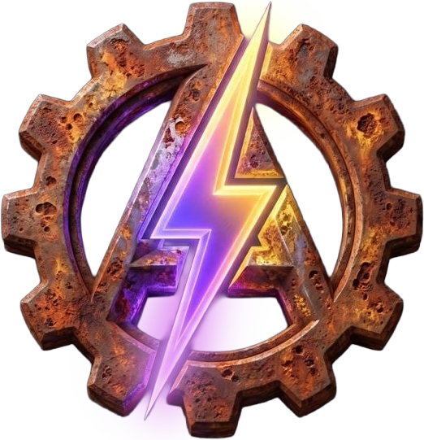

# @atlowchemi/webfont-generator

<p align="center">
  
</p>

<p align="center">
  <a href="https://www.npmjs.com/package/@atlowchemi/webfont-generator"></a>
  <a href="https://github.com/atlowChemi/vite-svg-2-webfont/blob/master/LICENSE"></a>
</p>

A native Rust [NAPI](https://napi.rs) addon that generates webfonts (SVG, TTF, EOT, WOFF, WOFF2) and their companion CSS/HTML from a set of SVG icon files.

This is a ground-up rewrite of [`@vusion/webfonts-generator`](https://github.com/vusion/webfonts-generator) in Rust — the original package and its authors deserve credit for the API design and template system that this project builds on. The JS implementation is unmaintained, so this package reimplements the same pipeline natively for better performance and long-term maintainability.

The API is largely compatible with `@vusion/webfonts-generator`, with a few differences:

- The `cssContext` and `htmlContext` callbacks receive only the context object. The original also passed `options` and the `handlebars` instance as additional arguments — those are no longer available.
- `formatOptions` is now strictly typed as `{ svg?: SvgFormatOptions; ttf?: TtfFormatOptions; woff?: WoffFormatOptions; woff2?: Woff2FormatOptions }`. The original accepted arbitrary `{ [format]: unknown }`; the `eot` key is no longer accepted (EOT is derived from the TTF output).
- A new `optimizeOutput` option runs an SVG path optimizer over each glyph before assembling the font. Defaults to `false`; optimization may reduce SVG path data, but does not guarantee smaller binary font output, so compare the generated sizes for your input set. Also available as `formatOptions.svg.optimizeOutput`.
- `formatOptions.woff2.compressionQuality` sets the Brotli compression quality (0–11) for WOFF2 output. Defaults to `11` (smallest output); lower it (e.g. to `10`) for faster encoding at a marginal size cost.
- A new `incremental` option (default `false`) retains parsed glyph data on the result so `result.regenerateAsync(files, changes?)` can rebuild after file changes without re-parsing the glyphs that didn't change or blocking the Node.js event loop. It refreshes the outputs in memory and, when the result was generated with `writeFiles`, writes refreshed fonts to disk too while skipping unchanged CSS/HTML companion files. You pass the full file set (in the order a fresh build would use) plus what changed, or omit `changes` to re-read/hash the full set and infer changes; the result is byte-identical to a fresh `generateWebfonts()` of that set, additions included.
- Generated font binaries (TTF, WOFF, etc.) may differ at the byte level because a different encoder is used, but the fonts are equally valid.
- CSS, HTML, and template output is identical.
- A new `variants` option supports multi-weight families with discrete designs.
- A new [`colorGlyphs`](https://atlowChemi.github.io/vite-svg-2-webfont/webfont-generator/node#color-selection) option preserves solid SVG colors for selected glyphs in TTF, WOFF, and WOFF2, disabled by default.

Performance scales better with glyph count — for larger icon sets the native pipeline is significantly faster.

## Installation and usage

```bash
npm install @atlowchemi/webfont-generator
```

Consumers on the following platforms do not need Rust or Cargo. Keep optional dependencies
enabled so your package manager installs the matching pre-built native binary.

| Platform       | Architecture      |
| -------------- | ----------------- |
| macOS          | x64, arm64        |
| Linux (glibc)  | x64, arm64, armv7 |
| Linux (musl)   | x64, arm64        |
| Windows (MSVC) | x64, arm64        |

```js
import { generateWebfonts } from '@atlowchemi/webfont-generator';

const result = await generateWebfonts({
    files: ['./icons/home.svg', './icons/search.svg'],
    dest: './dist/fonts',
    fontName: 'my-icons',
    types: ['woff2', 'woff'],
});

const css = result.generateCss();
const html = result.generateHtml();
```

## Incremental regeneration

Multi-weight families also support incremental builds. Set `incremental: true`, then use
`regenerateAsync({ variants: [{ variant: 'bold', files: [...] }, ...] }, changes)`
with every configured design's complete file list. Omit `changes` to re-diff every design. See the
[variant regeneration reference](https://atlowChemi.github.io/vite-svg-2-webfont/webfont-generator/node#variant-regeneration)
for input shapes, synchronous alternatives, and failure semantics.

```js
let files = ['./icons/home.svg', './icons/search.svg'];
let result = await generateWebfonts({ files, dest, fontName: 'my-icons', incremental: true });

// On a watch event, rebuild reusing cached geometry for unchanged glyphs. Pass the full file set
// (in fresh-build order) so additions land in the right position, plus what changed:
result = await result.regenerateAsync({ files }, [{ path: './icons/home.svg', changeType: 'changed' }]);
// Or omit changes when watcher hints are unavailable/untrusted:
result = await result.regenerateAsync({ files });
result.woff2; // refreshed bytes
```

The first argument is the complete file set after the change, in the order a fresh build would use (e.g. your glob result) — any file omitted from it is dropped. Each change is `{ path, changeType: 'added' | 'changed' | 'removed', name? }`, where `name` is the resolved glyph name if you apply a custom rename; otherwise added files derive their name from the file stem, changed files keep their current name, and removed files ignore it. When `changes` is omitted or `null`, every current file is re-read and hashed, and changes are inferred automatically. `regenerateAsync()` returns a replacement result; the receiver stays readable and unchanged while work runs and after failure. Assign the replacement before starting another rebuild because overlapping calls from the same result lineage are rejected. Disk writes are not transactional. The synchronous, mutating `regenerate()` method remains available when blocking the event loop is acceptable. Results generated with `cssContext` or `htmlContext` callbacks cannot be regenerated because those JavaScript callbacks cannot be re-run during a rebuild.

## Templates

Default CSS, SCSS, and HTML templates are available via the `/templates` export:

```js
import * as templates from '@atlowchemi/webfont-generator/templates';

console.log(templates.css); // path to default CSS template
console.log(templates.scss); // path to default SCSS template
console.log(templates.html); // path to default HTML template
```

## Documentation

See the [Node.js reference](https://atlowChemi.github.io/vite-svg-2-webfont/webfont-generator/node) for the complete API. For direct Rust or command-line use, see the separate [engine crate](../../crates/webfont-generator).

## License

[MIT](../../LICENSE)
